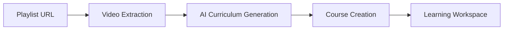
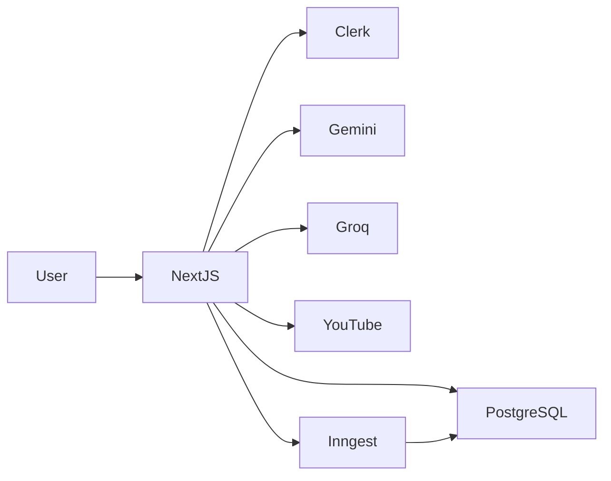

# 🚀 Coursa — AI-Powered Learning Operating System

> Transform any topic or YouTube playlist into a structured, interactive learning experience with AI-generated curricula, quizzes, notes, multilingual learning support, and progress tracking.


---

## 📖 Overview

<<<<<<< HEAD
Most online learning platforms suffer from:

* Unstructured YouTube playlists
* Information overload
* Poor retention
* Lack of personalization
* No learning progress tracking

Coursa solves these problems by converting topics and YouTube playlists into structured learning paths powered by AI.

Users can:

* Generate complete courses from a topic
* Import YouTube playlists
* Learn chapter-by-chapter
* Generate quizzes automatically
* Track progress
* Create notes
* Learn in multiple languages
=======


---

## ✨ Core Features

### 🎯 AI Course Generation

Generate an entire curriculum from a single topic.

Example:

```text
Input:
System Design

Output:
- Scalability
- Load Balancing
- Database Design
- Caching
- Messaging Queues
- Microservices
```

---

### 📺 Playlist → Course

Convert YouTube playlists into structured courses.



---

### 🧠 Learning Workspace

Each chapter provides:

* Video Content
* Chapter Summary
* Worked Examples
* Learning Resources
* Notes
* Progress Tracking

---

### ❓ AI Quiz Engine

Automatically generate quizzes from chapter content.

Supports:

* MCQs
* Recall Questions
* Knowledge Checks

---

### 🌍 Multi-Language Learning

Generate courses in:

* English
* Hindi
* Spanish
* French
* German

---

## 🏗️ High-Level Architecture



---

## ⚙️ Tech Stack

### Frontend

* Next.js 16
* React 19
* TypeScript
* Tailwind CSS
* Shadcn UI

### Backend

* Next.js API Routes
* Inngest
* QStash

### Database

* PostgreSQL
* Drizzle ORM

### Authentication

* Clerk

### AI

* Gemini
* Groq

### Storage

* Supabase

---

## 📚 Documentation

| Document           | Description              |
| ------------------ | ------------------------ |
| ARCHITECTURE.md    | System Architecture      |
| DATABASE.md        | Database Schema          |
| SYSTEM_DESIGN.md   | HLD & LLD                |
| API.md             | API Documentation        |
| PERFORMANCE.md     | Optimization Journey     |
| INTERVIEW_GUIDE.md | Interview Talking Points |

---

## 🚀 Quick Start

```bash
git clone https://github.com/Sanat1427/Coursa.git

cd Coursa

npm install

npm run dev
```

---

## 👨‍💻 Author

Sanat Kishore

GitHub: https://github.com/Sanat1427

---

## ⭐ Support

<<<<<<< HEAD
If you found this project useful, consider starring the repository.
=======
### Phase 1: Core Features (Completed)
- [x] AI Course Generator with Gemini 2.5 Flash.
- [x] Resilient Groq Llama-3.3 fallback client.
- [x] Split-screen course workspace with progress tracking.
- [x] Clerk authentication and webhook synchronization.

### Phase 2: Retention & Graphs (Completed)
- [x] Spaced repetition scheduler using the SM-2 algorithm.
- [x] Knowledge graph visualizer with concept dependency mapping.
- [x] Collaborative filtering recommendations engine.
- [x] Analytics dashboard tracking learning trends.

### Phase 3: Future Enhancements (Planned)
- [ ] Collaborative study rooms with shared notes.
- [ ] Exportable PDF study guides for offline learning.
- [ ] Interactive coding playgrounds next to the video workspace.
- [ ] Adaptive learning paths that adjust difficulty based on quiz performance.

---

## 23. Contributing

We welcome contributions from the open-source community! To contribute:
1.  **Fork** the repository.
2.  Create a feature branch using standard naming conventions:
    ```powershell
    git checkout -b feature/your-feature-name
    ```
3.  Commit your changes using clear commit messages:
    ```powershell
    git commit -m "feat: add user coding playground component"
    ```
4.  Push your branch to GitHub:
    ```powershell
    git push origin feature/your-feature-name
    ```
5.  Open a **Pull Request** and describe your changes.

---

## 24. License

This project is licensed under the **MIT License**. For details, see the [LICENSE](LICENSE) file in the root directory.

---

## 25. Author & Acknowledgements

*   **Coursa Team**: Advanced interactive AI learning platform development.

---

## 26. V1.1 Stability & Performance Refactor

To solve PostgreSQL database connection pool exhaustion (`eMAXCONNSESSION`) and minimize Vercel serverless request timeouts, the application underwent a stability refactor. Several high-latency and secondary learning-science features were temporarily suspended.

### Key Goals achieved:
1.  **Reduced Database Load**: Avoided relational table scans on spaced repetition schedulers, concept dependency mappings, and analytics trends on every workspace load.
2.  **Sub-100ms API Latency**: Bypassed synchronous concept readiness and analytics parsing during API request lifecycles.
3.  **Vercel Optimization**: Disabled background queues that execute intensive AI concept extraction and quiz generation during standard course lessons.
4.  **No Schema Deletions**: Maintained all existing migrations and relational table schemas, making it fully forward-compatible for subsequent V2 rollouts.

### Suspended Features (Flagged for Future Re-enabling):
All suspended code blocks are annotated with `// TODO: Re-enable in future release` tags.

*   **Revision & Spaced Repetition Engine**:
    *   GET/POST endpoints (`/api/revision/complete`, `/api/revision/today`, `/api/revision/upcoming`) have been hard-disabled and immediately return a `403 Forbidden` response.
    *   Revision widgets and spaced repetition flashcard drawers are hidden from the course workspace UI.
*   **Learning Insights & Analytics**:
    *   `/api/analytics` endpoint returns `403 Forbidden`.
    *   `/api/learning-insights` has been optimized to query only the active course progress records, returning stub category concepts to keep the **"Continue Learning" dashboard card** functional without slow DB joins.
    *   The frontend `/analytics` page has been replaced with a premium sketch-styled wobbly-border "Feature Temporarily Disabled / Coming Soon in V2" card.
*   **Personalized Recommendation Engine**:
    *   API endpoints (`/api/recommendations`, `/api/recommendations/event`, `/api/recommendations/popular`, `/api/recommendations/similar`) return `403 Forbidden`.
    *   Dynamic homepage recommendation widgets are commented out.
*   **Knowledge Graph**:
    *   `/api/knowledge-graph` and `/api/playlist/graph` return `403 Forbidden`.
    *   The playlist workspace interactive graph canvas is disabled.

### Fully Operational Core Path:
*   **AI Course Generator**: Full-course and quick-course syllabus layout planning from text prompts, playlists, and hybrid mode queries.
*   **Split-screen workspace**: Synchronized YouTube video player, timeline bookmarking, and progress indicators.
*   **Lesson Notebook**: Debounced autosaving notes panel.
*   **AI Quiz workspace**: Chapter-specific evaluators separate from revision queries.
*   **Progress Tracking**: Automatic view logs, completions records, and metrics summaries.

>>>>>>> 83d57f6 (course genration fixed)
