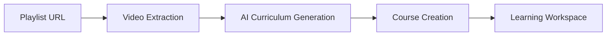
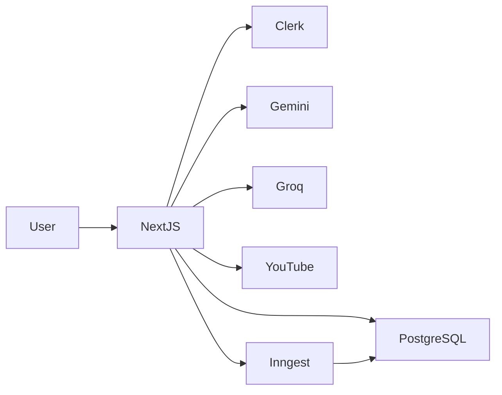

# 🚀 Coursa — AI-Powered Learning Operating System

> Transform any topic or YouTube playlist into a structured, interactive learning experience with AI-generated curricula, quizzes, notes, multilingual learning support, and progress tracking.


---

## 📖 Overview


Most online learning platforms suffer from:

* Unstructured YouTube playlists
* Information overload
* Poor retention
* Lack of personalization
* No learning progress tracking

Coursa solves these problems by converting topics and YouTube playlists into structured learning paths powered by AI.

Users can:

* Generate complete courses from a topic
* Import YouTube playlists
* Learn chapter-by-chapter
* Generate quizzes automatically
* Track progress
* Create notes
* Learn in multiple languages
=======


---

## ✨ Core Features

### 🎯 AI Course Generation

Generate an entire curriculum from a single topic.

Example:

```text
Input:
System Design

Output:
- Scalability
- Load Balancing
- Database Design
- Caching
- Messaging Queues
- Microservices
```

---

### 📺 Playlist → Course

Convert YouTube playlists into structured courses.



---

### 🧠 Learning Workspace

Each chapter provides:

* Video Content
* Chapter Summary
* Worked Examples
* Learning Resources
* Notes
* Progress Tracking

---

### ❓ AI Quiz Engine

Automatically generate quizzes from chapter content.

Supports:

* MCQs
* Recall Questions
* Knowledge Checks

---

### 🌍 Multi-Language Learning

Generate courses in:

* English
* Hindi
* Spanish
* French
* German

---

## 🏗️ High-Level Architecture



---

## ⚙️ Tech Stack

### Frontend

* Next.js 16
* React 19
* TypeScript
* Tailwind CSS
* Shadcn UI

### Backend

* Next.js API Routes
* Inngest

### Database

* PostgreSQL
* Drizzle ORM

### Authentication

* Clerk

### AI

* Gemini
* Groq

### Storage

* Supabase

---

## 📚 Documentation

| Document           | Description              |
| ------------------ | ------------------------ |
| ARCHITECTURE.md    | System Architecture      |
| DATABASE.md        | Database Schema          |
| SYSTEM_DESIGN.md   | HLD & LLD                |
| API.md             | API Documentation        |
| PERFORMANCE.md     | Optimization Journey     |
| INTERVIEW_GUIDE.md | Interview Talking Points |

---

## 🚀 Quick Start

```bash
git clone https://github.com/Sanat1427/Coursa.git

cd Coursa

npm install

npm run dev
```

---

## 👨‍💻 Author

Sanat Kishore

GitHub: https://github.com/Sanat1427

---

## ⭐ Support

<<<<<<< HEAD
If you found this project useful, consider starring the repository.
=======
### Phase 1: Core Features (Completed)
- [x] AI Course Generator with Gemini 2.5 Flash.
- [x] Resilient Groq Llama-3.3 fallback client.
- [x] Split-screen course workspace with progress tracking.
- [x] Clerk authentication and webhook synchronization.

### Phase 2: Retention & Graphs (Completed)
- [x] Spaced repetition scheduler using the SM-2 algorithm.
- [x] Knowledge graph visualizer with concept dependency mapping.
- [x] Collaborative filtering recommendations engine.
- [x] Analytics dashboard tracking learning trends.

### Phase 3: Future Enhancements (Planned)
- [ ] Collaborative study rooms with shared notes.
- [ ] Exportable PDF study guides for offline learning.
- [ ] Interactive coding playgrounds next to the video workspace.
- [ ] Adaptive learning paths that adjust difficulty based on quiz performance.

---


