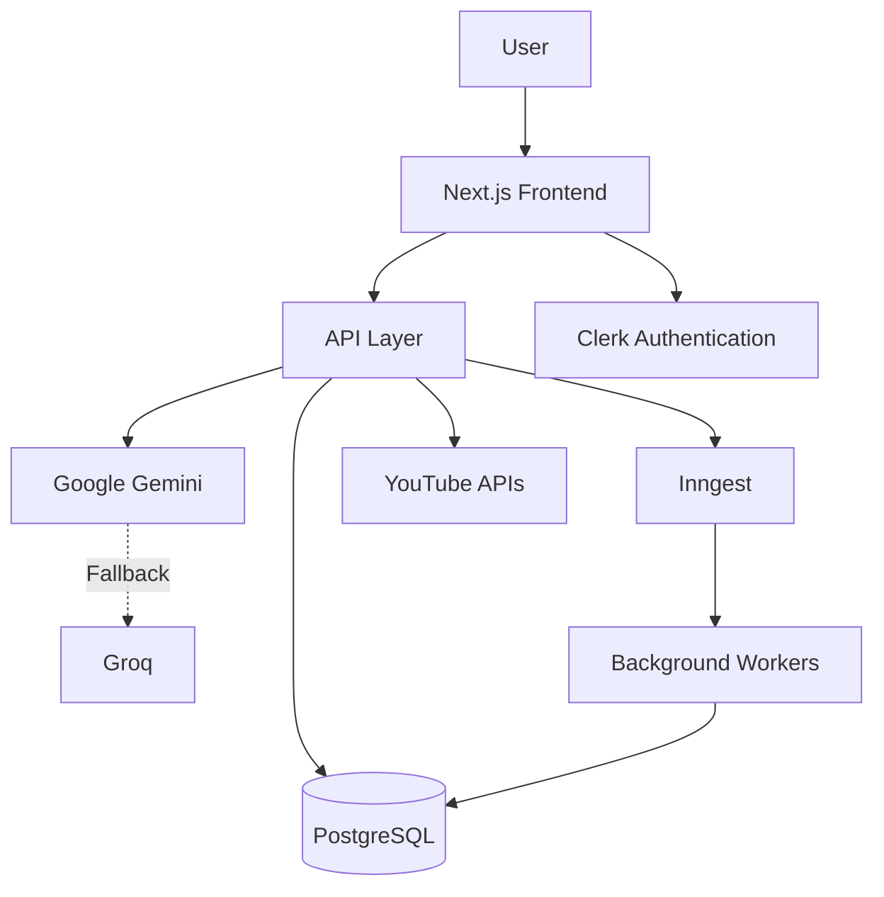
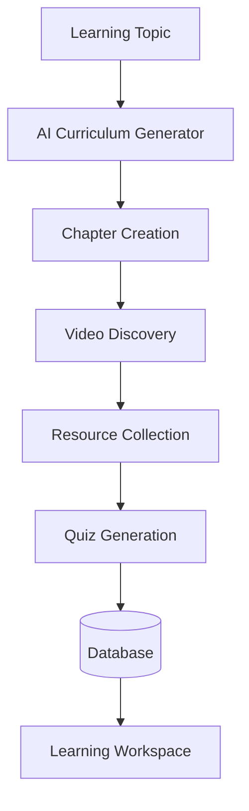
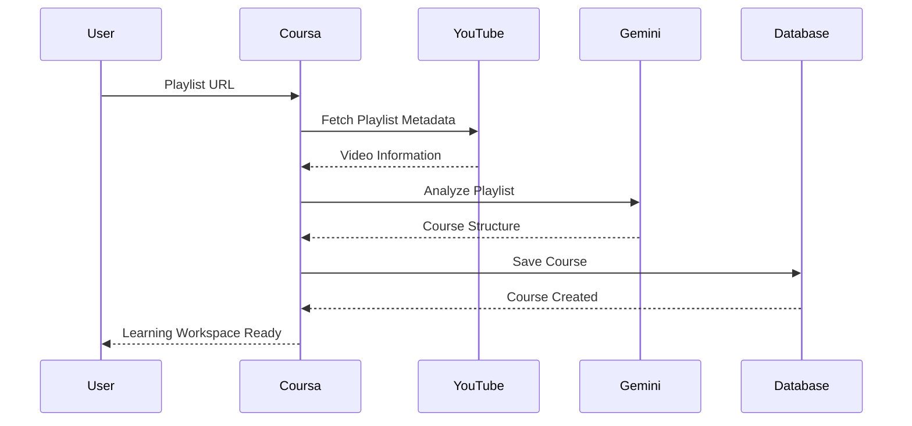
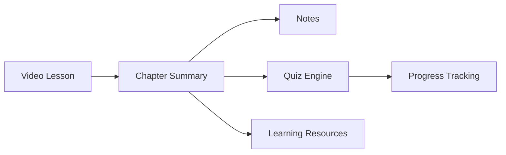
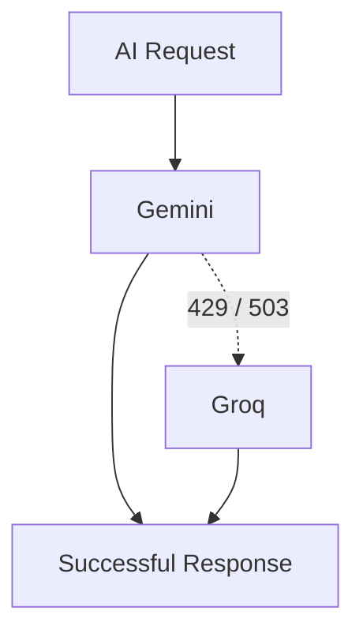
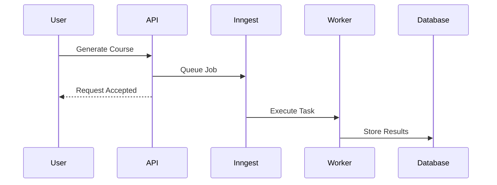
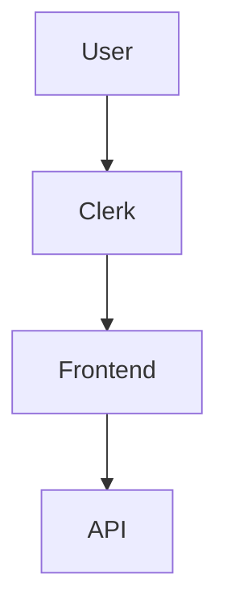
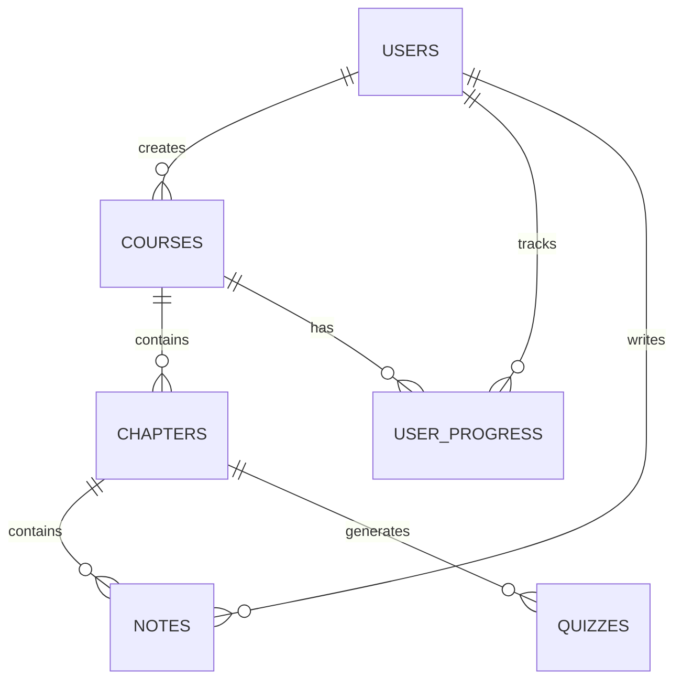
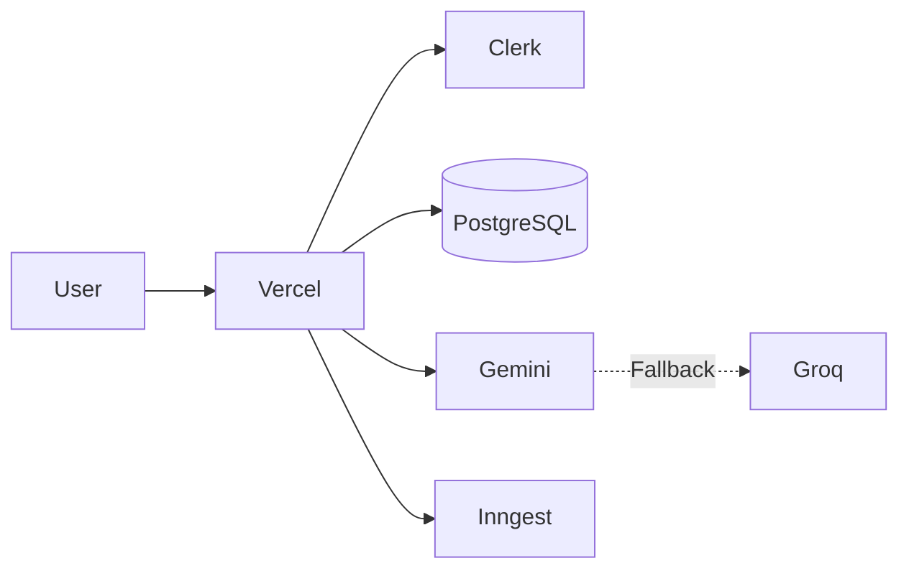

# 🏗️ Coursa Architecture

> Comprehensive architecture documentation for the Coursa AI-Powered Learning Operating System.

---

# Table of Contents

* System Overview
* Architectural Goals
* High-Level Architecture
* Core Components
* Course Generation Architecture
* Playlist-to-Course Architecture
* Learning Workspace Architecture
* AI Architecture
* Background Processing Architecture
* Authentication Architecture
* Database Architecture
* Deployment Architecture
* Scalability Strategy
* Reliability & Fault Tolerance
* Security Considerations
* Future Architecture Evolution

---

# System Overview

Coursa is an AI-powered learning platform that transforms:

* Learning Topics
* YouTube Playlists

into

* Structured Courses
* Learning Workspaces
* Interactive Learning Experiences

The platform combines:

* Next.js
* PostgreSQL
* Gemini
* Groq
* Clerk
* Inngest

to deliver scalable and personalized learning experiences.

---

# Architectural Goals

The architecture was designed around the following principles:

## 1. Scalability

Support thousands of users generating courses simultaneously.

## 2. Reliability

Continue functioning even when AI providers fail.

## 3. Performance

Deliver low-latency page loads.

## 4. Extensibility

Allow future integration of:

* Mobile Apps
* Additional AI Models
* Learning Analytics
* Team Learning Features

## 5. Cost Efficiency

Use background jobs and caching to minimize expensive AI calls.

---

# High-Level Architecture

---

# Core Components

The platform consists of six major subsystems.

## Frontend Layer

Responsible for:

* User Interface
* Routing
* State Management
* Learning Workspace
* Dashboard

Built with:

* Next.js 16
* React 19
* TypeScript
* Tailwind CSS
* Shadcn UI

---

## API Layer

Responsible for:

* Course Generation
* Playlist Processing
* Progress Tracking
* Quiz Generation
* Notes Management

Implemented using:

* Next.js Route Handlers

---

## AI Layer

Responsible for:

* Curriculum Generation
* Chapter Summaries
* Worked Examples
* Quiz Creation

Providers:

* Gemini
* Groq

---

## Database Layer

Responsible for:

* Course Storage
* User Data
* Progress Tracking
* Notes
* Learning Analytics

Implemented using:

* PostgreSQL
* Drizzle ORM

---

## Background Processing Layer

Responsible for:

* Long Running Tasks
* AI Processing
* Course Generation

Implemented using:

* Inngest

---

## Authentication Layer

Responsible for:

* User Management
* Sessions
* Authorization

Implemented using:

* Clerk

---

# Course Generation Architecture

The topic-based course generation workflow converts a single user prompt into a complete learning curriculum.

---

# Playlist-to-Course Architecture

Users can convert YouTube playlists into structured courses.

---

# Learning Workspace Architecture

The learning workspace acts as the central learning environment.

---

# AI Architecture

Coursa uses a multi-provider AI architecture.

## Primary Provider

Google Gemini

Used for:

* Curriculum Generation
* Chapter Summaries
* Worked Examples
* Quizzes

---

## Fallback Provider

Groq

Activated when:

* Gemini returns 429
* Gemini returns 503
* Gemini experiences downtime

---

## AI Failover Flow

---

# Background Processing Architecture

Long-running operations are executed asynchronously.

Benefits:

* Faster responses
* Better scalability
* Reduced timeout risk

---

# Authentication Architecture

Authentication is handled by Clerk.

Features:

* Session Management
* Social Login
* User Profiles
* Protected Routes

---

# Database Architecture

Coursa follows a relational database design.

Core entities:

---

# Deployment Architecture

The application is deployed using Vercel.

---

# Scalability Strategy

## Horizontal Scaling

Frontend:

* Stateless Next.js deployment

Backend:

* Serverless API routes

Database:

* Managed PostgreSQL

---

## Async Processing

AI workloads are offloaded to:

* Inngest Workers

instead of blocking requests.

---

## Future Scaling

Potential additions:

* Redis Cache
* Kafka Event Bus
* Dedicated AI Workers
* CDN Layer
* Multi-Region Deployment

---

# Reliability & Fault Tolerance

## AI Failover

Gemini → Groq

Ensures AI generation remains available.

---

## Background Processing

Long-running tasks are isolated from user-facing requests.

---

## Error Recovery

Implemented:

* Retry Logic
* Graceful Degradation
* Fallback Content

---

# Security Considerations

## Authentication

Managed by Clerk.

---

## Authorization

Users can only access:

* Their own courses
* Their own notes
* Their own progress

---

## Secrets Management

Environment variables store:

* Database URLs
* API Keys
* Authentication Secrets

---

## Input Validation

All user input is validated before processing.

---

# Future Architecture Evolution

Planned improvements:

## Learning Intelligence Layer

* Adaptive Learning Paths
* Personalized Recommendations
* Knowledge Gap Detection

## Mobile Architecture

* React Native Client

## Enterprise Features

* Team Learning
* Learning Analytics
* Organization Dashboards

## Infrastructure

* Redis
* Kafka
* Dedicated Worker Services
* Multi-Region Support

---

# Architecture Summary

Coursa is designed as a modern, scalable learning platform that combines:

* AI-Powered Course Generation
* YouTube-Based Learning
* Interactive Learning Workspaces
* Background Processing
* Multi-LLM Reliability
* Serverless Scalability

The architecture balances developer productivity, user experience, reliability, and future extensibility while maintaining a clean separation of concerns across frontend, backend, AI, and data layers.
