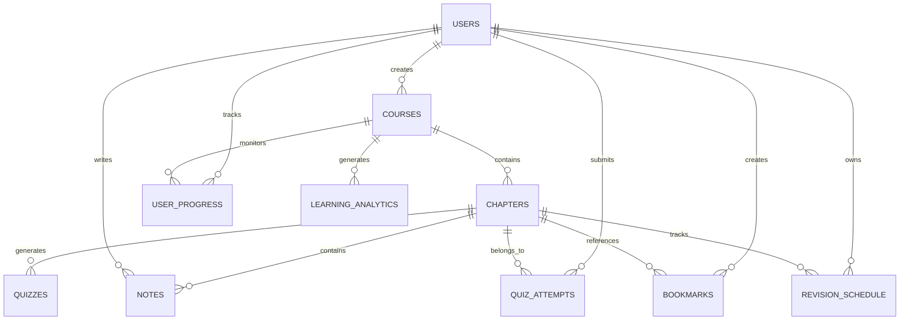
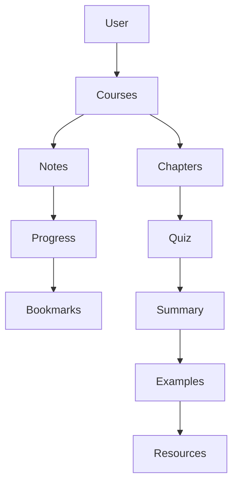

# 🗄️ Database Design

> Database architecture documentation for Coursa — AI-Powered Learning Operating System.

---

# Table of Contents

* Overview
* Database Philosophy
* Technology Choices
* Entity Relationship Diagram
* Core Tables
* Learning Tables
* Progress Tracking Tables
* Analytics Tables
* AI Generated Content Tables
* Relationships
* Query Patterns
* Indexing Strategy
* Scalability Considerations
* Design Decisions
* Future Improvements

---

# Overview

Coursa uses a relational database architecture built on PostgreSQL and Drizzle ORM.

The database is responsible for:

* User Management
* Course Storage
* Chapter Management
* Learning Progress
* Notes
* Quizzes
* Analytics
* AI Generated Content
* Revision Scheduling
* Knowledge Graph Relationships

---

# Database Philosophy

The database was designed using the following principles:

## 1. Normalize Core Data

Avoid duplication of:

* Users
* Courses
* Chapters

---

## 2. Separate Generated Content

AI-generated content is stored separately from core learning entities.

Benefits:

* Easier updates
* Better caching
* Lower regeneration costs

---

## 3. Track Learning Behavior

The database stores:

* Progress
* Quiz Attempts
* Completion History

allowing future personalization.

---

# Technology Choices

| Technology   | Purpose                     |
| ------------ | --------------------------- |
| PostgreSQL   | Primary Database            |
| Drizzle ORM  | Type-safe ORM               |
| UUIDs        | Distributed-safe IDs        |
| JSON Columns | Flexible AI content storage |

---

# Entity Relationship Diagram



---

# Core Tables

---

# Users Table

Stores registered users.

## Purpose

Acts as the root entity for all user-related operations.

## Schema

| Column    | Type      |
| --------- | --------- |
| id        | UUID      |
| email     | TEXT      |
| name      | TEXT      |
| imageUrl  | TEXT      |
| createdAt | TIMESTAMP |

---

## Relationships

```text
User
 ├── Courses
 ├── Notes
 ├── Progress
 ├── Quiz Attempts
 ├── Bookmarks
 └── Revision Schedule
```

---

# Courses Table

Stores generated courses.

## Purpose

Represents a complete learning program.

## Schema

| Column       | Type      |
| ------------ | --------- |
| courseId     | UUID      |
| courseName   | TEXT      |
| category     | TEXT      |
| language     | TEXT      |
| userId       | TEXT      |
| courseLayout | JSON      |
| createdAt    | TIMESTAMP |

---

## Example

```json
{
  "courseName": "System Design",
  "language": "English",
  "chapters": [
    {
      "chapterTitle": "Scalability"
    }
  ]
}
```

---

# Chapters Table

Stores individual learning chapters.

## Schema

| Column           | Type      |
| ---------------- | --------- |
| chapterId        | UUID      |
| courseId         | UUID      |
| chapterTitle     | TEXT      |
| youtubeVideoId   | TEXT      |
| contentMaterials | JSON      |
| createdAt        | TIMESTAMP |

---

## Example

```json
{
  "chapterTitle": "Load Balancing",
  "youtubeVideoId": "abcd123",
  "contentMaterials": {
    "articles": []
  }
}
```

---

# Learning Tables

---

# Notes Table

Stores learner notes.

## Purpose

Allow learners to create chapter-specific notes.

## Schema

| Column    | Type      |
| --------- | --------- |
| noteId    | UUID      |
| userId    | UUID      |
| chapterId | UUID      |
| content   | TEXT      |
| createdAt | TIMESTAMP |

---

# Bookmarks Table

Stores saved learning positions.

## Purpose

Resume learning from a specific location.

## Schema

| Column     | Type    |
| ---------- | ------- |
| bookmarkId | UUID    |
| userId     | UUID    |
| chapterId  | UUID    |
| timestamp  | INTEGER |

---

# Quiz Tables

---

# Quizzes Table

Stores generated quiz content.

## Schema

| Column    | Type      |
| --------- | --------- |
| quizId    | UUID      |
| chapterId | UUID      |
| questions | JSON      |
| createdAt | TIMESTAMP |

---

## Example

```json
[
  {
    "question": "What is load balancing?",
    "options": ["A", "B", "C", "D"],
    "answer": "A"
  }
]
```

---

# Quiz Attempts Table

Tracks learner performance.

## Schema

| Column    | Type      |
| --------- | --------- |
| attemptId | UUID      |
| userId    | UUID      |
| quizId    | UUID      |
| score     | INTEGER   |
| createdAt | TIMESTAMP |

---

# Progress Tracking Tables

---

# User Progress Table

Tracks chapter completion.

## Schema

| Column    | Type    |
| --------- | ------- |
| userId    | UUID    |
| courseId  | UUID    |
| chapterId | UUID    |
| completed | BOOLEAN |
| views     | INTEGER |

---

## Purpose

Supports:

* Progress Bars
* Completion Percentage
* Learning Analytics

---

# Revision Schedule Table

Supports spaced repetition.

## Schema

| Column       | Type      |
| ------------ | --------- |
| id           | UUID      |
| userId       | UUID      |
| chapterId    | UUID      |
| reviewNumber | INTEGER   |
| scheduledAt  | TIMESTAMP |
| completedAt  | TIMESTAMP |
| easeFactor   | DECIMAL   |

---

## Learning Model

```text
Review 1 → Day 1

Review 2 → Day 3

Review 3 → Day 7

Review 4 → Day 14

Review 5 → Day 30
```

---

# AI Generated Content Tables

---

# Chapter Summaries

Stores AI-generated summaries.

## Purpose

Reduce repeated LLM calls.

## Benefits

* Lower costs
* Faster page loads
* Better user experience

---

# Worked Examples

Stores AI-generated examples.

## Example

```text
Input:
Binary Search

Output:
Worked Example
Step-by-step Explanation
```

---

# Knowledge Graph Tables

Stores learning relationships.

## Graph Nodes

Represents:

* Concepts
* Topics
* Skills

---

## Graph Edges

Represents:

* Prerequisites
* Relationships
* Dependencies

---

## Example

```text
Arrays
  |
  V

Binary Search

  |
  V

Balanced Trees
```

---

# Learning Analytics Tables

Stores user learning behavior.

## Tracks

* Total Study Time
* Chapters Completed
* Quiz Accuracy
* Learning Consistency

---

# Relationship Summary



---

# Query Patterns

Most common queries:

## Load Course

```sql
SELECT *
FROM courses
WHERE courseId = ?
```

---

## Load Chapter

```sql
SELECT *
FROM chapters
WHERE chapterId = ?
```

---

## User Progress

```sql
SELECT *
FROM user_progress
WHERE userId = ?
```

---

## Revision Schedule

```sql
SELECT *
FROM revision_schedule
WHERE userId = ?
```

---

# Indexing Strategy

Important indexes:

## Courses

```sql
courseId
userId
```

---

## Chapters

```sql
chapterId
courseId
```

---

## User Progress

```sql
userId
courseId
chapterId
```

---

## Revision Schedule

```sql
userId
chapterId
scheduledAt
```

---

# Scalability Considerations

Current database supports:

* Thousands of users
* Millions of notes
* Millions of quiz attempts

with proper indexing.

---

# Future Scaling

Future improvements include:

## Redis

For:

* Course caching
* Progress caching

---

## Read Replicas

Separate:

* Reads
* Writes

---

## Analytics Warehouse

Move historical analytics into:

* BigQuery
* ClickHouse

---

# Design Decisions

## Why PostgreSQL?

Benefits:

* ACID compliance
* Strong relational support
* JSON support
* Excellent scalability

---

## Why Drizzle ORM?

Benefits:

* Type Safety
* Performance
* Excellent TypeScript support

---

## Why UUIDs?

Benefits:

* Globally unique
* Safe for distributed systems
* Better scalability

---

# Database Summary

The Coursa database is designed to support:

* AI-generated courses
* Personalized learning
* Progress tracking
* Quiz systems
* Knowledge retention
* Future recommendation systems

while maintaining strong relational integrity, scalability, and performance.
