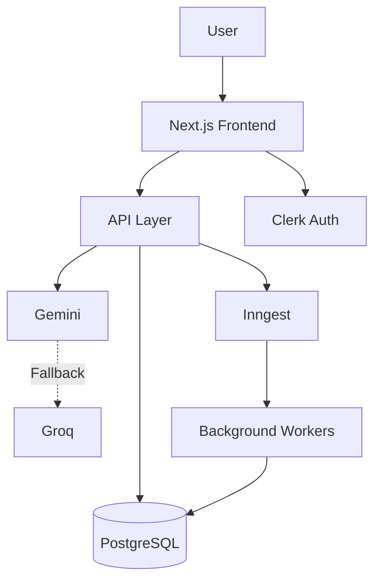
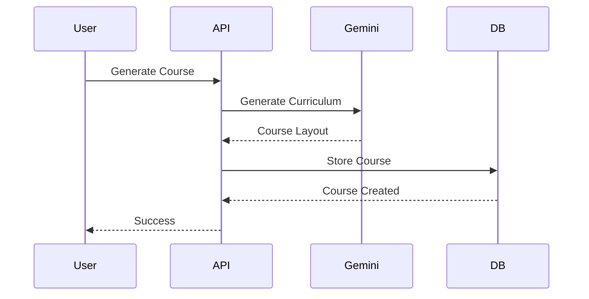
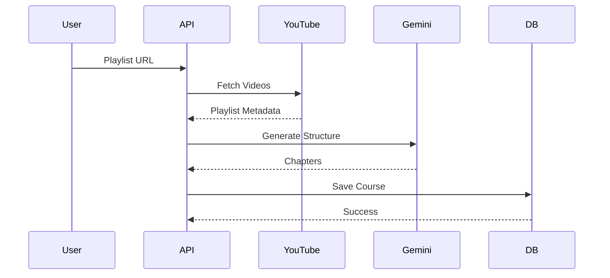
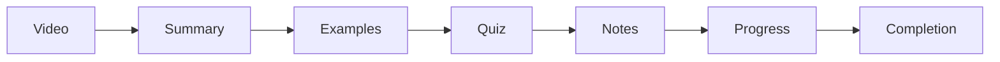
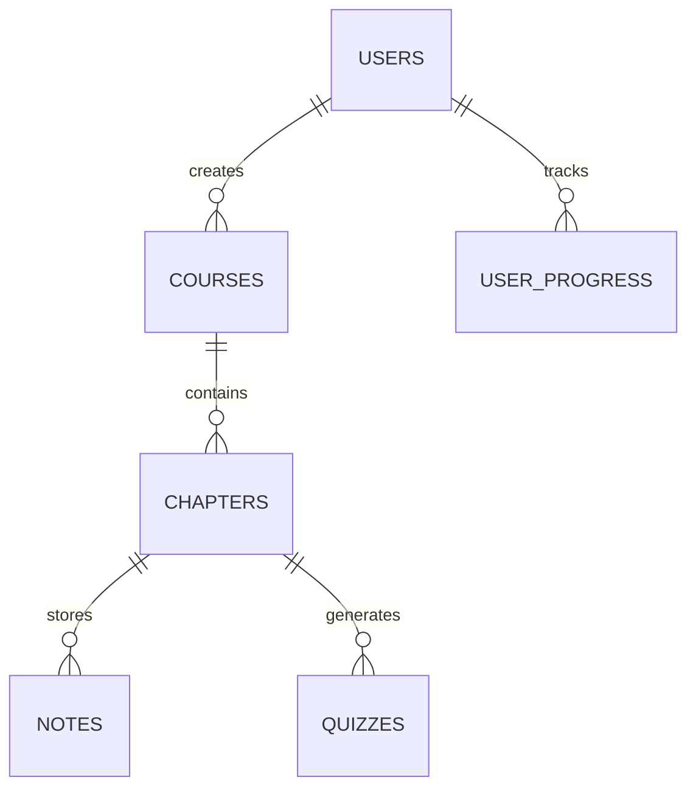
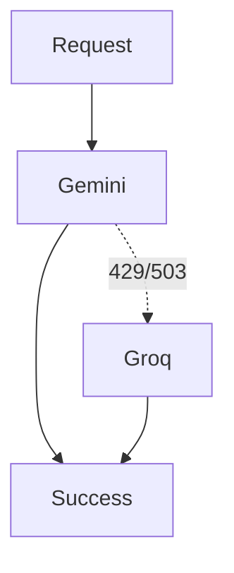
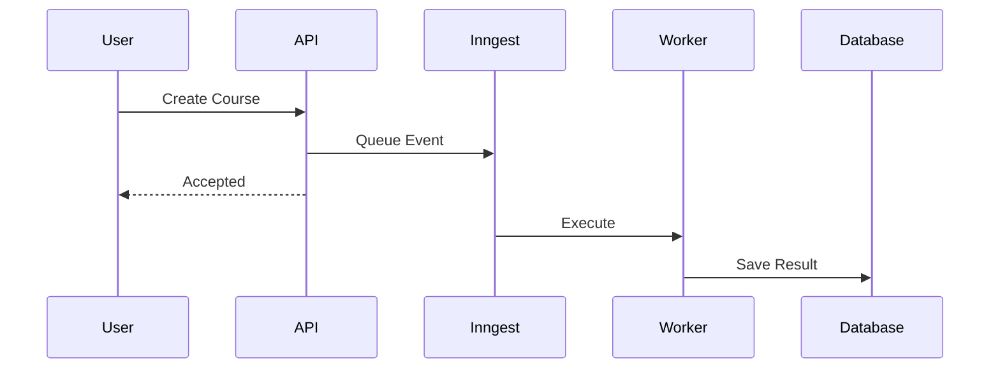

# 🏛️ System Design Document

> High-Level Design (HLD) and Low-Level Design (LLD) for Coursa — AI Powered Learning Operating System

---

# Table of Contents

* Introduction
* Functional Requirements
* Non-Functional Requirements
* High-Level Design
* System Components
* End-to-End Workflows
* Low-Level Design
* Database Design
* API Design
* AI Architecture
* Event Driven Architecture
* Scalability
* Reliability
* Security
* Trade-Offs
* Future Improvements

---

# Introduction

Coursa is an AI-powered learning platform that converts:

* Learning Topics
* YouTube Playlists

into

* Structured Courses
* Personalized Learning Workspaces
* Interactive Learning Experiences

The system combines:

* Next.js
* PostgreSQL
* Gemini
* Groq
* Inngest
* Clerk

to create an end-to-end learning ecosystem.

---

# Functional Requirements

The system should allow users to:

## Course Generation

* Generate a course from a topic
* Generate a course from a YouTube playlist
* Generate multilingual courses

---

## Learning

* Watch curated videos
* Read summaries
* Review worked examples
* Take quizzes
* Save notes

---

## User Management

* Sign Up
* Sign In
* Manage Courses
* Track Progress

---

## Analytics

* Track completion
* Monitor progress
* Store learning history

---

# Non Functional Requirements

---

## Scalability

Support:

```text
10,000+ Users

100,000+ Courses

1,000,000+ Chapter Views
```

---

## Reliability

Platform should continue functioning even when:

```text
Gemini Fails

YouTube API Fails

Background Jobs Fail
```

---

## Performance

Target:

```text
Dashboard Load < 2s

Chapter Load < 1s

Course Generation < 30s
```

---

## Availability

Target:

```text
99.9%
```

---

# High Level Design

## System Architecture



---

# Core Components

---

## Frontend Layer

Responsibilities:

* Routing
* Dashboard
* Workspace
* Notes
* Progress Tracking

Technology:

```text
Next.js 16
React 19
TypeScript
```

---

## Backend Layer

Responsibilities:

* Business Logic
* APIs
* Course Management
* User Operations

Technology:

```text
Next.js Route Handlers
```

---

## AI Layer

Responsibilities:

* Curriculum Generation
* Quiz Generation
* Summaries
* Examples

Technology:

```text
Gemini
Groq
```

---

## Database Layer

Responsibilities:

* Persistent Storage
* User Data
* Learning Data

Technology:

```text
PostgreSQL
Drizzle ORM
```

---

## Background Processing

Responsibilities:

* Course Generation
* Content Processing
* Long Running Tasks

Technology:

```text
Inngest
```

---

# Course Generation Workflow



---

# Playlist Generation Workflow



---

# Learning Workflow



---

# Low Level Design

---

# Course Service

Responsibilities:

```text
Create Course

Generate Chapters

Store Course

Fetch Course
```

---

## Internal Flow

```mermaid
flowchart TD

    Topic

    --> Curriculum Generator

    --> Chapter Builder

    --> Course Repository

    --> Database
```

---

# Chapter Service

Responsibilities:

```text
Chapter Loading

Video Management

Summary Generation

Quiz Management
```

---

# Quiz Service

Responsibilities:

```text
Generate Questions

Evaluate Answers

Track Scores
```

---

# Progress Service

Responsibilities:

```text
Track Views

Track Completion

Calculate Progress
```

---

# Notes Service

Responsibilities:

```text
Create Notes

Update Notes

Delete Notes

Fetch Notes
```

---

# Database Design

Major entities:



---

# API Design

---

## Create Course

```http
POST /api/course
```

Request:

```json
{
  "topic":"System Design"
}
```

Response:

```json
{
  "courseId":"123"
}
```

---

## Generate Playlist Course

```http
POST /api/playlist
```

---

## Chapter Learning

```http
GET /api/course/chapter-learning
```

---

## Quiz Generation

```http
POST /api/quiz
```

---

# AI Architecture

Coursa uses a multi-provider architecture.

---

## Primary Provider

```text
Gemini
```

Used for:

* Course Generation
* Summaries
* Quizzes

---

## Fallback Provider

```text
Groq
```

Used when:

```text
429 Rate Limited

503 Unavailable
```

---

## Failover Flow



---

# Event Driven Architecture

Large operations are executed asynchronously.

---

## Why?

Avoid:

```text
Request Timeouts

Slow UI

Blocking Operations
```

---

## Flow



---

# Scalability Design

Current Architecture:

```text
Next.js

PostgreSQL

Gemini

Groq

Inngest
```

---

# Horizontal Scaling

Frontend:

```text
Stateless

Can Scale Horizontally
```

---

# Database Scaling

Future:

```text
Read Replicas

Redis Cache

Connection Pooling
```

---

# AI Scaling

Future:

```text
Model Routing

Provider Selection

Dedicated AI Workers
```

---

# Reliability Design

---

## AI Failover

```text
Gemini

↓

Groq
```

---

## Retry Strategy

Implemented for:

```text
AI Calls

Background Jobs

External APIs
```

---

## Graceful Degradation

If AI generation fails:

```text
Show Existing Content

Display Placeholder

Retry Later
```

---

# Security Design

---

## Authentication

Handled by:

```text
Clerk
```

---

## Authorization

Users can access:

```text
Only Their Courses

Only Their Notes

Only Their Progress
```

---

## Secrets

Stored in:

```text
Environment Variables
```

---

## Input Validation

Validate:

```text
Topics

Playlist URLs

User Inputs
```

before processing.

---

# Engineering Challenges

---

## Challenge 1

AI Rate Limits

Problem:

```text
429

503
```

Solution:

```text
Gemini

↓

Groq
```

---

## Challenge 2

Slow Course Generation

Solution:

```text
Background Jobs

Inngest
```

---

## Challenge 3

Incorrect Video Selection

Solution:

```text
Video Validation

Metadata Filtering
```

---

## Challenge 4

Database Connection Exhaustion

Problem:

```text
EMAXCONNSESSION
```

Solution:

```text
Connection Reuse

Query Optimization

Background Processing
```

---

# Trade-Offs

## Why PostgreSQL?

Pros:

```text
Strong Consistency

Relational Data

JSON Support
```

Cons:

```text
Requires Connection Management
```

---

## Why Inngest?

Pros:

```text
Simple Background Jobs

Serverless Friendly
```

Cons:

```text
Additional Infrastructure
```

---

## Why Gemini?

Pros:

```text
Strong Reasoning

High Quality Content
```

Cons:

```text
Rate Limits
```

---

# Future Improvements

---

## Learning Intelligence

```text
Adaptive Learning

Personalized Paths

Knowledge Gap Detection
```

---

## Mobile Application

```text
React Native
```

---

## Advanced Analytics

```text
Retention Tracking

Learning Insights
```

---

## Infrastructure

```text
Redis

Kafka

Dedicated Workers

Multi Region Deployment
```

---

# Conclusion

Coursa demonstrates production-level software engineering concepts including:

* Full Stack Development
* AI Integration
* System Design
* Event Driven Architecture
* Scalability Planning
* Database Design
* Background Processing
* Reliability Engineering

The system is designed to be extensible, scalable, and resilient while providing a seamless learning experience for users.
