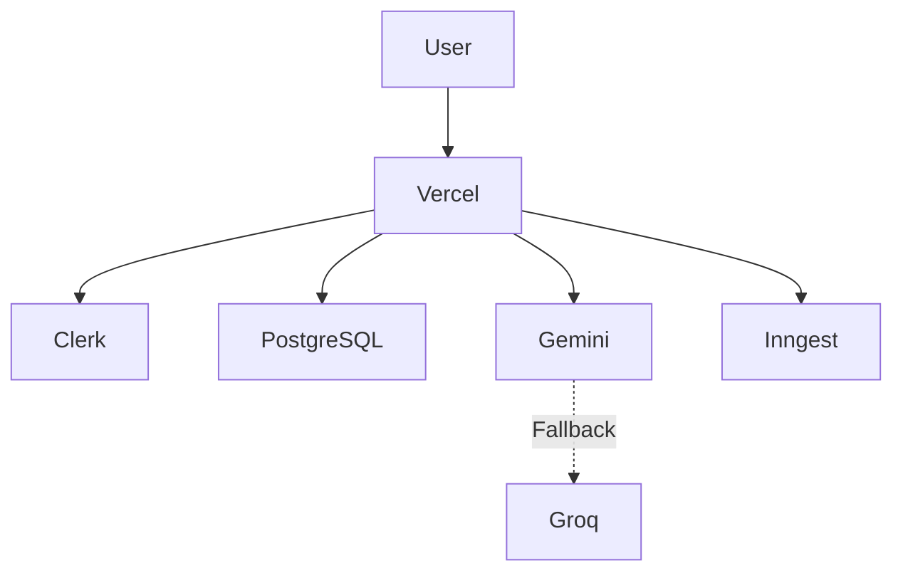

# 🚀 Deployment Guide

> Production deployment architecture for Coursa.

---

# Table of Contents

* Overview
* Infrastructure
* Architecture
* Environment Variables
* Vercel Deployment
* Database Setup
* Clerk Setup
* AI Setup
* Monitoring
* Troubleshooting

---

# Infrastructure Overview



---

# Production Stack

| Service    | Purpose         |
| ---------- | --------------- |
| Vercel     | Hosting         |
| PostgreSQL | Database        |
| Clerk      | Authentication  |
| Gemini     | AI              |
| Groq       | AI Fallback     |
| Inngest    | Background Jobs |
| Supabase   | Storage         |

---

# Environment Variables

Create:

```env
DATABASE_URL=

NEXT_PUBLIC_CLERK_PUBLISHABLE_KEY=
CLERK_SECRET_KEY=

GEMINI_API_KEY=
GROQ_API_KEY=

INNGEST_EVENT_KEY=
INNGEST_SIGNING_KEY=

NEXT_PUBLIC_SUPABASE_URL=
NEXT_PUBLIC_SUPABASE_ANON_KEY=
```

---

# Vercel Deployment

## Step 1

Push repository:

```bash
git push origin main
```

---

## Step 2

Import repository into Vercel.

---

## Step 3

Configure environment variables.

---

## Step 4

Deploy.

---

# Database Setup

## PostgreSQL

Recommended:

* Neon
* Supabase Postgres
* Railway Postgres

---

## Migrations

Run:

```bash
npx drizzle-kit push
```

---

# Clerk Setup

Create:

```text
Clerk Application
```

Add:

```env
NEXT_PUBLIC_CLERK_PUBLISHABLE_KEY
CLERK_SECRET_KEY
```

---

# Gemini Setup

Create:

```text
Google AI Studio Project
```

Generate:

```text
GEMINI_API_KEY
```

---

# Groq Setup

Create:

```text
Groq Console Project
```

Generate:

```text
GROQ_API_KEY
```

---

# Inngest Setup

Used for:

* Course Generation
* Playlist Processing
* AI Workflows

Required:

```env
INNGEST_EVENT_KEY
INNGEST_SIGNING_KEY
```

---

# Monitoring

Recommended:

## Vercel Analytics

Track:

* Page Views
* Performance
* Errors

---

## Logging

Monitor:

```text
API Failures

AI Failures

Database Errors

Worker Errors
```

---

# Common Production Issues

## Issue 1

### Error

```text
429 Rate Limited
```

### Solution

Automatic fallback:

```text
Gemini
↓
Groq
```

---

## Issue 2

### Error

```text
EMAXCONNSESSION
```

### Cause

Too many PostgreSQL connections.

### Solution

* Connection pooling
* Reduce parallel queries
* Cache frequently accessed data

---

## Issue 3

### Error

```text
Function Timeout
```

### Cause

Heavy AI generation inside request lifecycle.

### Solution

Move to:

```text
Inngest Background Jobs
```

---

# Scaling Strategy

Current:

```text
Vercel
PostgreSQL
Gemini
Groq
Inngest
```

Future:

```text
Redis
Kafka
Dedicated Workers
Read Replicas
CDN
```

---

# Deployment Checklist

Before production:

* Environment variables configured
* Database migrations executed
* Clerk configured
* Gemini configured
* Groq configured
* Inngest configured
* Vercel deployment successful

---

# Production Readiness

Coursa currently supports:

* AI Course Generation
* Playlist Learning
* User Authentication
* Notes
* Quizzes
* Progress Tracking
* Background Processing

while maintaining scalability, reliability, and fault tolerance.
